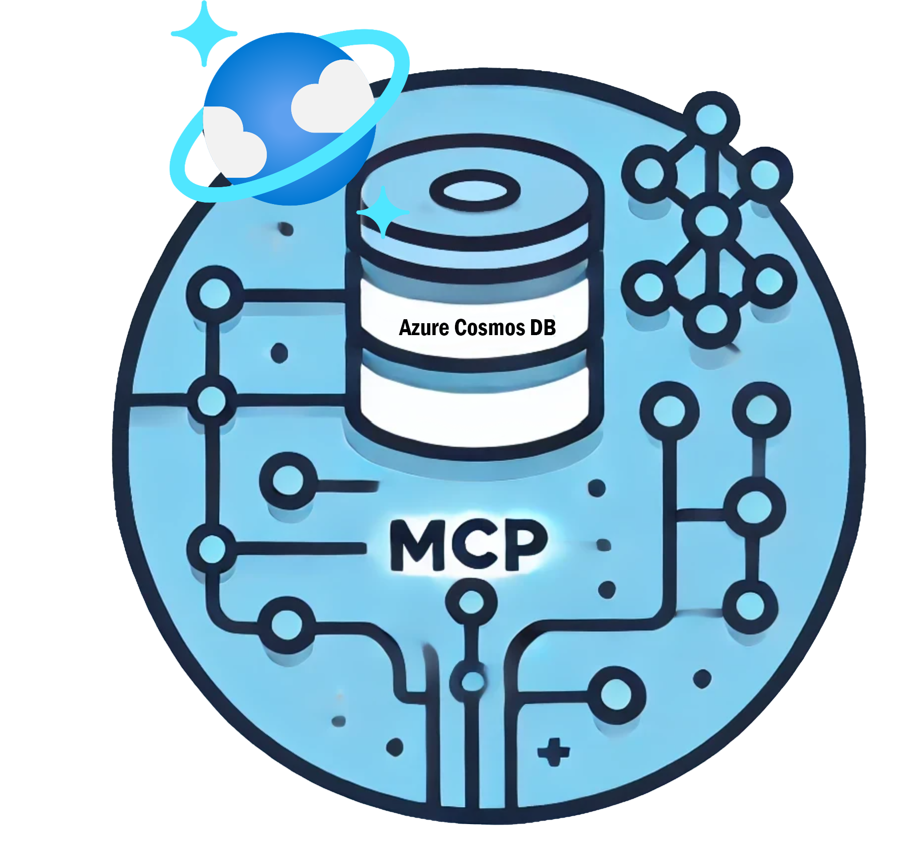

# Azure Cosmos DB MCP  Server Samples

  

## What is this? 🤔

This repo showcases how to build Model Context Protocol (MCP) servers using Azure Cosmos DB. Explore ready-to-run samples in multiple programming languages including TypeScript,GoLang and Java.
 
 - [JavaScript MCP Server Sample for Azure Cosmos DB](/javascript)
 - [GoLang MCP Server Sample for Azure Cosmos DB](/golang)
 - [Java MCP Server Sample for Azure Cosmos DB](/java)
 - [Python MCP Server Sample for Azure Cosmos DB](/python)

## 📦 Official Azure Cosmos DB MCP server 

The Azure MCP Server enables AI agents and other types of clients to interact with Azure resources through natural language commands. It implements the Model Context Protocol (MCP) to provide these key features of multipl Azure services including Azure Cosmos DB, Please visit the repository for the latest source code, documentation, and installation instructions:

👉 **[Azure MCP GitHub Repository](https://github.com/Azure/azure-mcp)**

## Contributing

This project welcomes contributions and suggestions.  Most contributions require you to agree to a
Contributor License Agreement (CLA) declaring that you have the right to, and actually do, grant us
the rights to use your contribution. For details, visit https://cla.opensource.microsoft.com.

When you submit a pull request, a CLA bot will automatically determine whether you need to provide
a CLA and decorate the PR appropriately (e.g., status check, comment). Simply follow the instructions
provided by the bot. You will only need to do this once across all repos using our CLA.

This project has adopted the [Microsoft Open Source Code of Conduct](https://opensource.microsoft.com/codeofconduct/).
For more information see the [Code of Conduct FAQ](https://opensource.microsoft.com/codeofconduct/faq/) or
contact [opencode@microsoft.com](mailto:opencode@microsoft.com) with any additional questions or comments.

## Trademarks

This project may contain trademarks or logos for projects, products, or services. Authorized use of Microsoft
trademarks or logos is subject to and must follow
[Microsoft's Trademark & Brand Guidelines](https://www.microsoft.com/en-us/legal/intellectualproperty/trademarks/usage/general).
Use of Microsoft trademarks or logos in modified versions of this project must not cause confusion or imply Microsoft sponsorship.
Any use of third-party trademarks or logos are subject to those third-party's policies.
