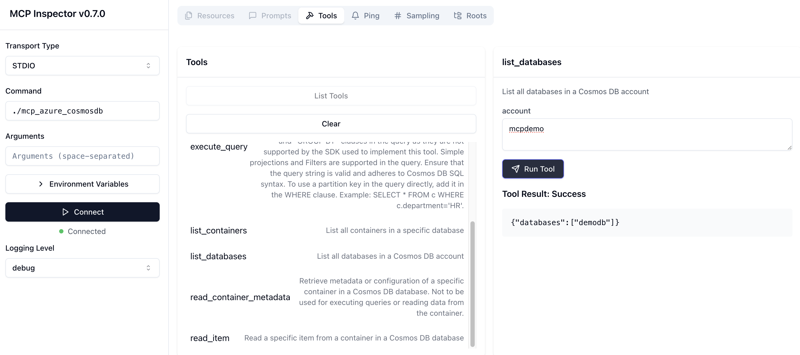

# MCP server for Azure Cosmos DB using the Go SDK

This is an implementation of a MCP server for Azure Cosmos DB built using its [Go SDK](https://pkg.go.dev/github.com/Azure/azure-sdk-for-go/sdk/data/azcosmos). It exposes the following tools for interacting with Azure Cosmos DB:

- **List Databases**: Retrieve a list of all databases in a Cosmos DB account.
- **List Containers**: Retrieve a list of all containers in a specific database.
- **Read Container Metadata**: Fetch metadata or configuration details of a specific container.
- **Create Container**: Create a new container in a specified database with a defined partition key.
- **Add Item to Container**: Add a new item to a specified container in a database.
- **Read Item**: Read a specific item from a container using its ID and partition key.
- **Execute Query**: Execute a SQL query on a Cosmos DB container with optional partition key scoping.

> The project uses [mcp-go](https://github.com/mark3labs/mcp-go) as the MCP implementation.

Here is a demo (recommend watching at 2x speed 😉) using [VS Code in Agent Mode](https://code.visualstudio.com/docs/copilot/chat/chat-agent-mode):

[](https://www.youtube.com/watch?v=CsM-mspWJeM)

## How to run

> Word(s) of caution: As much as I want folks to benefit from this, I have to call out that Large Language Models (LLMs) are non-deterministic by nature and can make mistakes. I would recommend you to **always validate** the results and queries before making any decisions based on them.

```bash
git clone https://github.com/AzureCosmosDB/azure-cosmos-mcp-server
cd azure-cosmos-mcp-server/mcp_cosmosdb_go

go build -o mcp_azure_cosmosdb main.go
```

### Configure the MCP server

This will differ based on the MCP client/tool you use. For VS Code you can [follow these instructions](https://code.visualstudio.com/docs/copilot/chat/mcp-servers#_add-an-mcp-server) on how to configure this server using a `mcp.json` file.

Here is an example of the [mcp.json file](mcp.json):

```json
{
  "servers": {
    "Azure Cosmos DB MCP (Golang)": {
      "type": "stdio",
      "command": "enter path to binary e.g. /Users/demo/Desktop/mcp_azure_cosmosdb"
    }
  }
}
```

Here is an example of Claude Desktop configuration:

```json
{
  "mcpServers": {
    "Azure Cosmos DB MCP (Golang)": {
      "command": "enter path to binary e.g. /Users/demo/Desktop/mcp_azure_cosmosdb",
      "args": []
    }
    //other MCP servers...
  }
}
```

## Azure Cosmos DB RBAC permissions and authentication

The user principal you will be using should have permissions ([control](https://learn.microsoft.com/en-us/azure/cosmos-db/nosql/security/how-to-grant-control-plane-role-based-access?tabs=built-in-definition%2Ccsharp&pivots=azure-interface-cli) and [data plane](https://learn.microsoft.com/en-us/azure/cosmos-db/nosql/security/how-to-grant-data-plane-role-based-access?tabs=built-in-definition%2Ccsharp&pivots=azure-interface-cli)) to execute CRUD operations on database, container, and items.

Authentication - The MCP server makes use of [DefaultAzureCredential](https://learn.microsoft.com/en-us/azure/developer/go/sdk/authentication/credential-chains#defaultazurecredential-overview). For instance, you can log in locally using Azure CLI ([az login](https://learn.microsoft.com/en-us/cli/azure/authenticate-azure-cli)), or any other supported authentication, and the token will be automatically used - no key or connection string required.

> (not recommended) You can set the `COSMOSDB_ACCOUNT_KEY` environment variable in the MCP server configuration:

  ```json
  {
    "servers": {
      "CosmosDB Golang MCP": {
        "type": "stdio",
        "command": "/Users/demo/mcp_azure_cosmosdb",
        "env": {
          "COSMOSDB_ACCOUNT_KEY": "enter the key"
        }
      }
    }
  }
  ```

You are good to go! Now spin up [VS Code in Agent Mode](https://code.visualstudio.com/docs/copilot/chat/chat-agent-mode), or any other MCP tool (like Claude Desktop) and try this out!

## Local dev/testing

Start with [MCP inspector](https://modelcontextprotocol.io/docs/tools/inspector) - `npx @modelcontextprotocol/inspector ./mcp_azure_cosmosdb`


